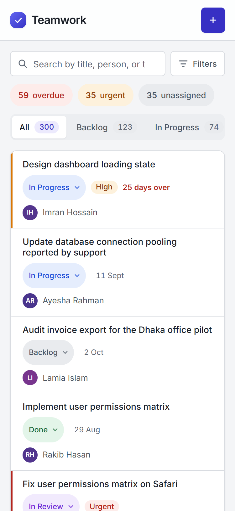
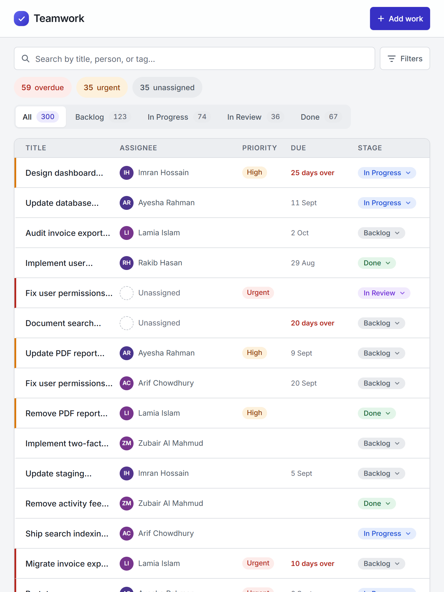
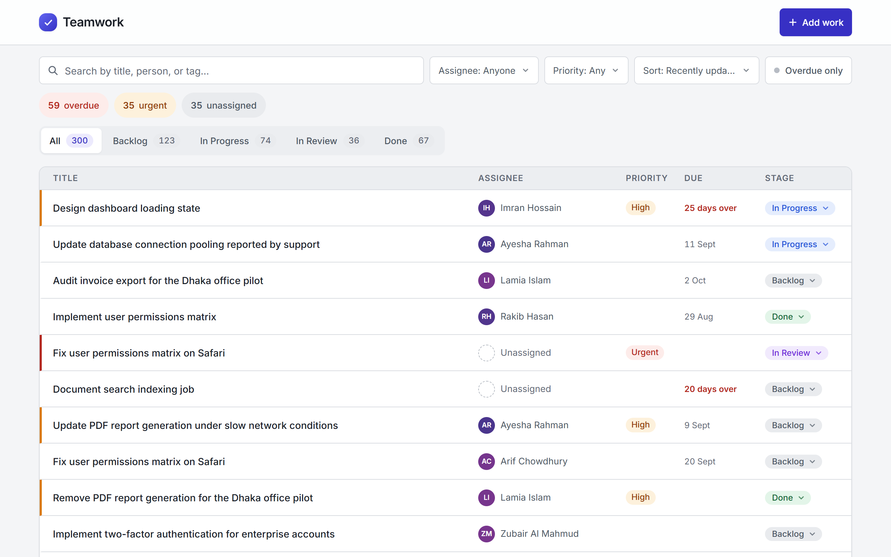
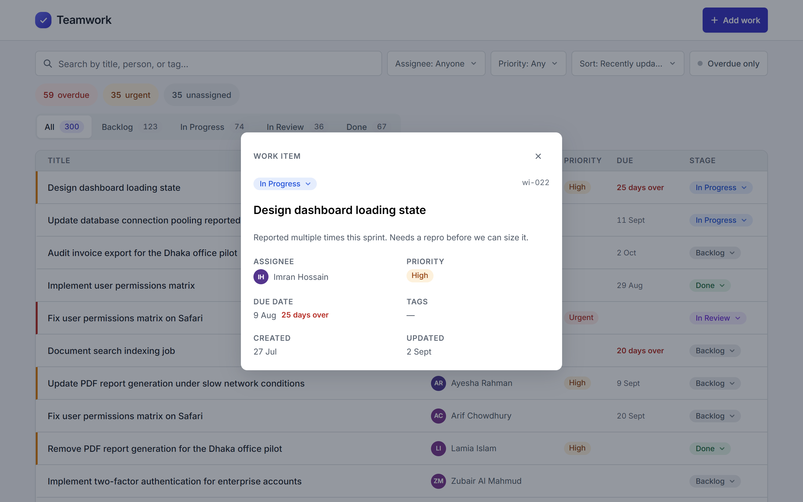

# Teamwork - Team Task System

A task-tracking tool for a team of 8–15 people who share a body of work and have outgrown a spreadsheet. Anyone can see what the team is working on, find a specific item in seconds, move work through stages, and share a filtered view with a colleague - on a phone as well as a desktop.

Built for the WEBNS Technology Ltd. React Front-End practical exercise.


## Screenshots

| 375px (mobile) | 768px (tablet) |
| -------------- | -------------- |
|  |  |

**1280px (desktop):**



**Item detail (modal, shareable via `?item=<id>`):**



## Running it

Requires Node 20+.

```bash
npm install
npm run dev
```

Open http://localhost:5173.

Other scripts:

```bash
npm run build     # type-check + production build
npm run preview   # serve the production build
npm run lint      # oxlint
```

No database or environment variables are needed. The app ships with a generated seed dataset (~300 work items) served through an in-memory repository that simulates network latency - see [Data](#data) below.

## Stack

| Choice                              | Why                                                                                                                                                                                 |
| ----------------------------------- | ----------------------------------------------------------------------------------------------------------------------------------------------------------------------------------- |
| Vite + React 19 + TypeScript        | Required stack; Vite for a zero-magic setup. TypeScript runs strict (`strict`, `noUncheckedIndexedAccess`, `noImplicitOverride`) with no `any` anywhere.                            |
| Tailwind CSS v4 + custom `@theme` tokens | The brief bans component kits (they draw the screen for you) but explicitly accepts CSS frameworks. All design tokens — type scale, spacing rhythm, semantic color system — live in one `@theme` block in `global.css`, so utilities like `bg-surface` / `text-ink-muted` derive from the same single source of truth a hand-rolled system would have. |
| Hand-rolled Redux-style store       | Work-item data flows through typed actions → a pure reducer → selectors, dispatched via context. There is no API, so simulating the Redux pattern without the library keeps every line explainable. |
| URL as filter state                 | Search, filters, sort, and pagination live in query params - shareable views and correct back-button behavior come for free.                                                        |
| Zero UI dependencies                | Per the brief, no component kit - and in the end no headless library either. Dialogs are the native `<dialog>` element (focus trap, Escape, inert background from the platform); the dropdown is one hand-rolled `Dropdown<T>` implementing the ARIA listbox pattern (arrows, Home/End, Enter, Escape, `aria-activedescendant`), reused for filters, sort, stage moves, and the add form. |

## Architecture

Feature-based structure: each feature owns everything it needs. Code moves to `shared/` only once two or more features use it.

```
src/
  app/                  # App shell, providers, global styles, design tokens
    styles/
      global.css        # Tailwind @theme tokens (single source of truth for color,
                        #   type, spacing, motion) + base layer conventions
  features/
    work-items/         # Core feature: list, item cards/rows, detail modal, stage
                        #   moves, add form, store (actions/reducer/selectors),
                        #   seed data, repository, view params + filtering logic
    filters/            # Search, stage tabs, filter fields, mobile filter sheet
  shared/               # Only cross-feature primitives: Dialog, Dropdown, useUrlQuery
                        #   (each graduated here once a second feature needed it)
```

### Design system

Everything visual derives from the Tailwind `@theme` tokens in `src/app/styles/global.css`:

- **Type scale** - compact (12–22px): this is a tool people scan, not a marketing page.
- **Spacing** - 4px rhythm throughout.
- **Color** - cool-gray neutrals, an indigo accent, and semantic status tones (danger / warning / success / info / review). Every text color clears WCAG AA (4.5:1) against the background it sits on; each status has a strong tone for text and a subtle tone for badge fills.
- **Interaction** - one consistent `:focus-visible` ring app-wide; 44px minimum touch targets; `prefers-reduced-motion` respected.

### Accessibility

- **Contrast audited, not assumed.** Every token pair in use was checked against WCAG AA (4.5:1) with a script; the muted text tone was darkened after failing on tinted backgrounds (4.16 → 4.85 on the worst pair).
- **Keyboard end-to-end**: Tab reaches search, every filter, each row's title link and stage control, and pagination. Dropdowns follow the listbox pattern (arrows/Home/End/Enter/Escape); dialogs trap focus natively and close on Escape.
- **Semantics**: rows are a `<ul>`, titles are real links (middle-click and copy-link work), states use `role="status"`/`role="alert"`, and a polite live region announces result counts as filters change.
- **Loading, error, and empty are three different screens**: shimmer skeletons matched to real row height (nothing jumps when data lands), an error panel with retry (reproduce with `?fail=1`), and empty states that say why and what to do - filtered-empty offers a one-click "clear search & filters".

## Data

The app is frontend-only by design (see [What I didn't build](#what-i-didnt-build)). Data comes from a generated fixture of ~300 work items behind a small async repository that simulates latency and can simulate failure - so loading, error, and empty states are real, and a real backend could replace the module without touching the UI.

The seed data is deliberately messy, because a layout that only survives tidy rows would fall apart in production:

- Titles of wildly different lengths, some far too long for comfort
- Items with no owner, no due date, or no description
- Due dates spread across overdue, today, and far future
- At least one inconveniently long person name

### Data model

A work item is: `id`, `title`, `description?`, `stage`, `priority`, `assignee?`, `dueDate?`, `tags`, `createdAt`, `updatedAt`.

**Left out deliberately:** subtasks, comments, attachments, time estimates. A team fleeing an untrusted spreadsheet needs ownership, urgency, and progress visible at a glance - not a project-management suite. Every omitted field is one less thing to fill in when "new work can be added without ceremony."

### Workflow stages

Four: **Backlog → In Progress → In Review → Done**. Enough to answer "where is this?", few enough to fit as a segmented control on a 375px screen. More stages would push stage selection into a dropdown on mobile and slow down the "moving it is quick" requirement.

## Product decisions

- **A list, not a board.** The brief's core verbs are _find_, _narrow down_, and _spot what's urgent_ - scanning problems, which favor a dense vertical list. A Kanban board buries overdue items inside columns and collapses badly at 375px. Stage changes happen inline on each item instead of via drag-and-drop.
- **First screen = the filtered list.** Search, stage tabs, and quick filters sit above the list; everything else waits behind a click. Item details open in a URL-addressable modal so the list never loses its place.
- **An attention strip instead of a dashboard.** "What's urgent, overdue, or unassigned is obvious" is answered by three live-count chips above the list ("59 overdue · 35 urgent · 35 unassigned", done work excluded) - each one a one-tap toggle for the matching filter. No separate reporting screen needed.
- **Mobile is a different rendering, not a squeezed one.** Desktop gets dense rows; below tablet width the same items render as cards. Filters collapse into a bottom sheet - a row of dropdowns is not a mobile answer.
- **Shareable by URL.** Search, filters, sort, and pagination serialize to query params. Copy the address bar, send it, and a colleague sees the same view.

## Assumptions

Written down rather than silently guessed, per the brief:

- **One shared team, no auth.** Everyone sees everything; there is no login, no per-user permissions, and no "my tasks" persistence beyond filtering by assignee. A team of 8–15 fleeing a spreadsheet trusts each other with the data.
- **English-only UI**, though names and content are Bangladesh-realistic to match the team.
- **Due dates are dates, not datetimes.** "Overdue" flips at local midnight; a task-tracking tool doesn't need hour precision.
- **Deleting work is out of scope.** Moving an item to Done is the terminal action; a real deployment would want archive/delete with undo, which deserves more care than the time budget allowed.

## What I didn't build

- **A backend.** The brief states a frontend-only submission scores full marks on everything being judged; the repository layer is shaped so PostgreSQL + an API could slot in behind it later.
- **Drag-and-drop.** High interaction cost, poor keyboard/touch accessibility for the payoff. An explicit stage control is faster and works everywhere.
- **Subtasks, comments, attachments** - see the data model rationale above.

## Decisions I'm least confident about

1. **List over board** - a hybrid (list with an optional board view) was the alternative; cut for scope within the four-hour budget. If the team's workflow is genuinely stage-driven, a board toggle would be the first thing I'd add.
2. **Hand-rolled store over Redux Toolkit** - RTK would bring devtools and battle-tested patterns; the hand-rolled version keeps the dependency graph small and every line explainable. The action/reducer shape is identical, so swapping RTK in later is mechanical.
3. **A hand-rolled dropdown over a headless library** - the brief explicitly welcomes Radix/React Aria, and they cover edge cases (typeahead, portal positioning near viewport edges) mine doesn't. I chose owning ~180 explainable lines over a dependency; in a larger product I'd take Radix.
4. **Optimistic stage moves with silent rollback** - a failed move rolls the badge back without a toast. With a real flaky network I'd add an announcement; with the simulated backend, failure is only reachable via `?fail=1`, so I spent the time elsewhere.

## AI tooling

Built with Claude Code as a pair programmer: scaffolding, first-pass component and styling implementation, and seed-data generation, working from a plan and design decisions agreed step by step. All code is reviewed, understood, and committed by hand - per the brief, every line can be explained and changed live.
